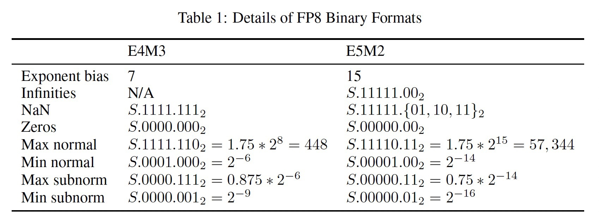

# sparrow
model compression: quantization, pruning

## Tasks
1. :white_check_mark: FP8 qnt schema
2. :building_construction: modules in FP8
3. :stop_sign: autograd, scale & shift
4. :stop_sign: FP8 & FP32 comparision


## Quantization

### schema:
1. fp --> int  
```math
X^{(int)} = clip(round(X/s), x_{min}, x_{max})
```

2. high fp --> low fp  
The conversion between fps isn't actually a conversion, but just a reinterpretation of the same data in memory.  


FP8 format:


Based on IEEE-754, a real number is represented as:
```math
\begin{equation}
\begin{split}
real &= (-1)^{b_{n-1}} * 2^{exp} * 1.f \\
&=(-1)^{b_{n-1}} * 2^{E-bias} * (1+\sum_{i=1}^k{b_{k-i}*2^{-i}})
\end{split}
\end{equation}
```
subnormal number:
```math
\begin{equation}
\begin{split}
real &= (-1)^{b_{n-1}} * 2^{1-bias} * (0+\sum_{i=1}^k{b_{k-i}*2^{-i}}) \\
	 &= (-1)^{b_{n-1}} * 2^{1-bias} * 2^(-i_{min}) * (1+\sum_{i=i_min}^{i_max}{b_{k-i}*2^{-i}})
\end{split}
\end{equation}
```

conversion schema:
```math
fp8 = \left\{
	\begin{aligned}
	clip(fp32)  \\
	round(fp32) \\
	map(specials)
	\end{aligned}
\right.
```


**ref:** 
- https://sandbox.mc.edu/~bennet/cs110/flt/dtof.html
- https://evanw.github.io/float-toy/
