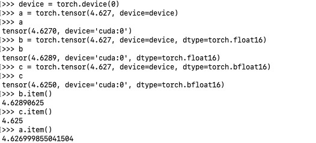

# sparrow
model compression: quantization, pruning

## Quantization

### schema:
1. fp --> int

2. high fp --> low fp
The conversion between fps isn't actually a conversion, but just a reinterpretation of the same data in memory.  


Based on IEE754, a real number is represented as:
```math
\begin{equation}
\begin{split}
real &= (-1)^{b_{n-1}} * 2^{exp} * 1.f \\
&=(-1)^{b_{n-1}} * 2^{E-bias} * (1+\sum_{i=1}^k{b_{k-i}*2^{-i}})
\end{split}
\end{equation}
```

therefore, 

```math
\begin{equation}
\begin{split}

exp &= floor(log_2(real)) \\
1.f &= real * 2^{-exp} = 1 + d_1/2 + d_2/2^2 + ... + d_m/2^m

\end{split}
\end{equation}
```

Then, EnMm style fp can be converted as:


**ref:** 
- https://sandbox.mc.edu/~bennet/cs110/flt/dtof.html
- https://evanw.github.io/float-toy/
